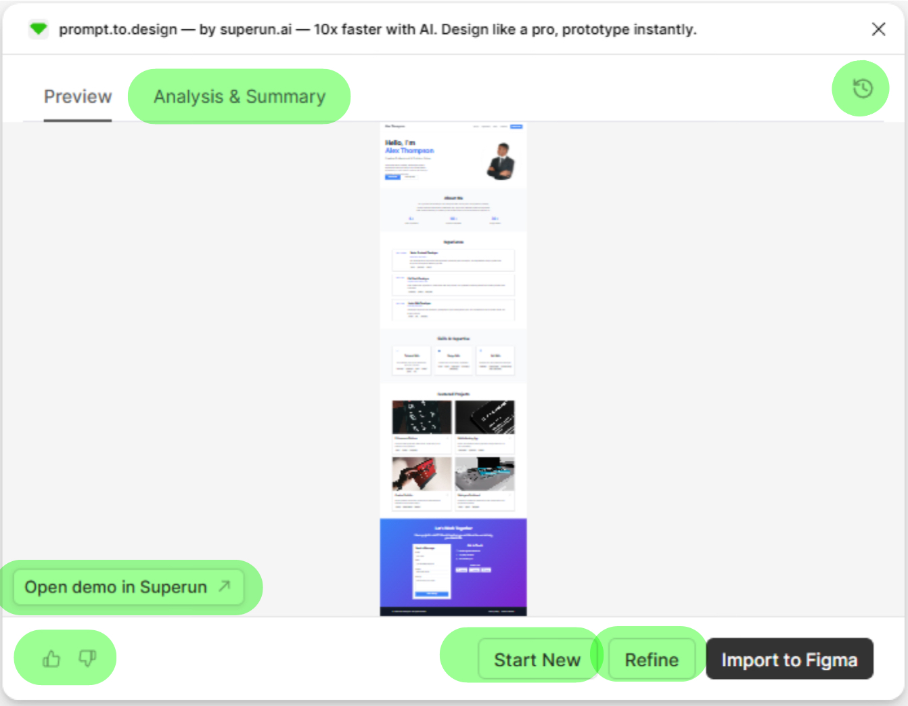
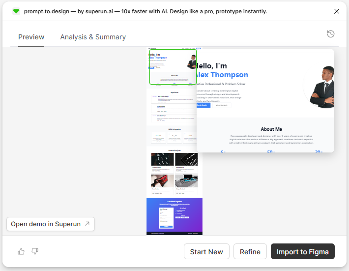
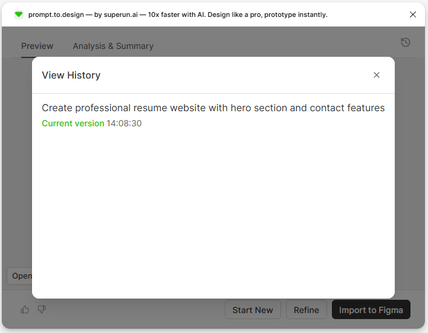
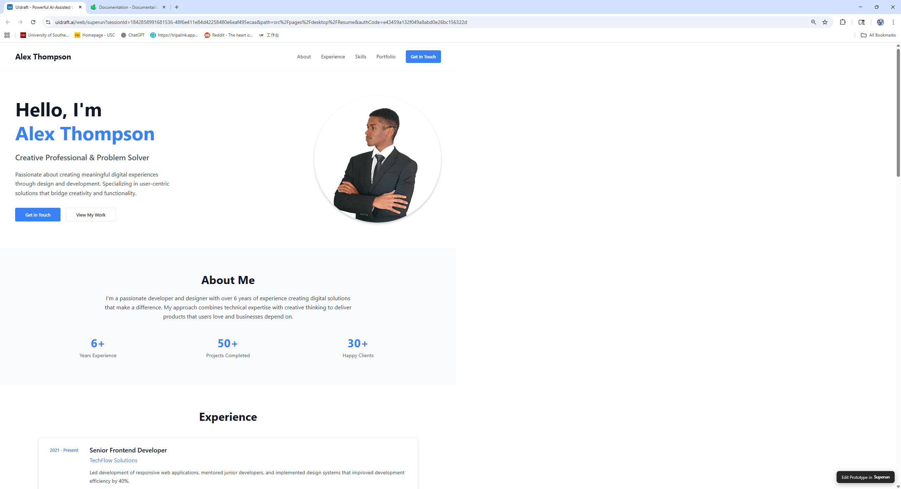
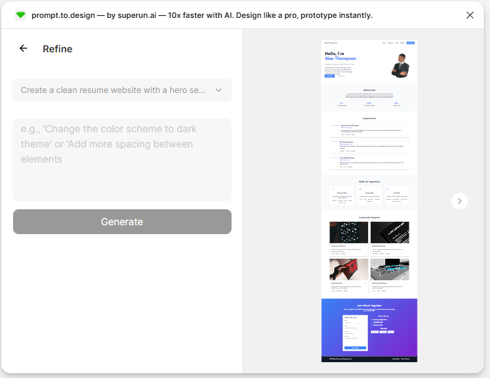

每次生成后——无论是 **Kickstart**,**Style Transfer**,**Region Design** 还是 **Smart Fill**——Prompt.to.design 都会显示一个统一的结果面板.
本页解释了结果视图的每个部分以及如何使用它.

---

## 🖼 预览面板

**预览面板**将生成的布局显示为可滾动的长图像.

### 你可以做什么:
- **懸停缩放**并检查细节  
- **滾动**查看完整生成的布局  
- **点击部分**跳转到突出显示的区域

---

## 🔍 悬停缩放

将鼠标移到预览上可放大任何部分.

这可以帮助您:
- 检查间距
- 检查排版
- 预览组件清晰度

---

## 🧠 分析与總结

切换到此选项Card以了解系统如何解释您的提示.

你会看到:
- **分析** — 了解您的意图  
- **摘要** — 生成的结构和关鍵部分

---

## 🕘 查看历史记录

**历史面板**显示每个生成Step.

您可以:
- 查看之前的提示
- 重新访问早期版本
- 比较改进

---

## 🌐 在 superun 中打开演示

点击 **Open demo in superun** 在完整网页中查看生成的布局.

为什么使用它:
- 查看真实比例的设计  
- 平滑滾动  
- 在浏览器上下文中预览

---

## ✏️ 完善您的结果

使用 **Refine** 调整当前版本*无需重新开始*.

示例:
- "让间距更大"
- "切换到深色主题"
- "更新主视觉布局"

---

## 🛠 导入到 Figma

当您满意时,点击 **Import to Figma**.

这将:
- 将生成的布局帶入您的 Figma 文件  
- 将其转换为可编辑的Frame,自动布局,文本图層和组件  
- 保持样式一致性

---

## 👍 / 👎 提供反馈

在左下角,您可以对每一代进行评分.

- 👍 好结果
- 👎 不符合预期
- 💬 添加评论以提高未来模型的性能

---

## 🎯 總结

该结果面板在所有功能之间共享.  
无論您如何生成布局,您總是会看到:

- 预览  
- 分析与摘要  
- 懸停缩放  
- 历史记录  
- 演示视图  
- 完善  
- 导入到 Figma  
- 反馈工具

此页面使您可以完全控制每一代,并帮助您充满信心地快速迭代.